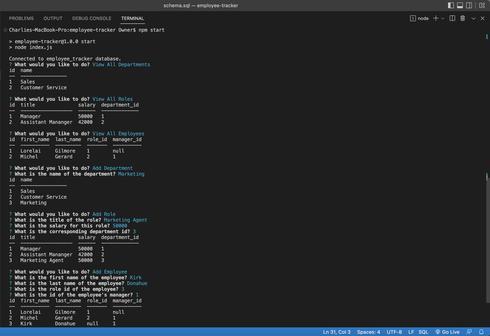

# Employee Tracker

## Description

A command line application used to record and track employees and their roles within each department of a workplace. This application uses MySQL and Inquirer packages in combination so that the database is viewed and updated completely through the inquirer prompts, without the user needing to know any sql.

## Installation

In order to install this application, clone the source code onto your personal machine. Using your computer's terminal, navigate into the folder holding the source code and run `npm i` in order to install the codes dependencies. Then, you can run `npm start` in order to start up the application and you will be prompted with a list of actions. From there, all you need to do is answer the prompts!

## Usage

## Credits

Made with 💛 by me, Charlie. You can find me on GitHub, [here](https://gist.github.com/charliec1665).